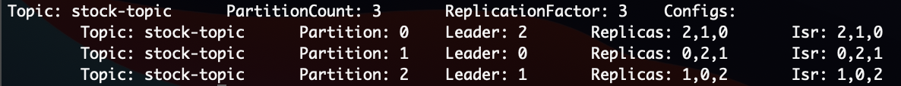

# market-data
[market-data-manager](https://github.com/chiusday/market-data/tree/main/market-data-manager) returns stock prices produced by [stocker](https://github.com/chiusday/market-data/tree/main/stocker) delivered via Kafka. The prices is reactively shown in the UI for a specified period of time. If the time limit to wait  is reached the data streaming to the UI stops and the endpoint to stream the pirces has to be called again. 

## Overview:


**Note**: the internal queue is only there to make the data streaming to UI simplier


## How to setup and run Kafka for this app
<details><summary>Zookeeper</summary>
<p>

- make sure you are in Kafka's /bin directory
- start Zookeeper

```
./zookeeper-server-start.sh ../config/zookeeper.properties
```
</p>
</details>

<details><summary>Broker</summary>
<p>

- Add the below properties in the server.properties

```
listeners=PLAINTEXT://localhost:9092
auto.create.topics.enable=false
```

-   Start up the 1st Kafka Broker 

```
./kafka-server-start.sh ../config/server.properties
```

- Make a copy of server.properties, name it server-1.properties. Then update the values in server-1.properties shown below.

```
broker.id=1
listeners=PLAINTEXT://localhost:9093
```

-   Start up the 2nd Kafka Broker

```
./kafka-server-start.sh ../config/server-1.properties
```

- Make another copy of server.properties, name it server-2.properties. Then update the values in server-2.properties shown below.

```
broker.id=2
listeners=PLAINTEXT://localhost:9094
```

-   Start up the 3rd Kafka Broker

```
./kafka-server-start.sh ../config/server-2.properties
```

</p>
</details>

<details><summary>Topic</summary>
<p>

- Create the topic

```
./kafka-topics.sh --create --topic stock-topic -zookeeper localhost:2181 --replication-factor 3 --partitions 3
```

- Verify that the topic is created successfully

```
./kafka-topics.sh --topic stock-topic -zookeeper localhost:2181 --describe
```


**Make sure that stock-topic is in all 3 partitions and all 3 partitions have unique values for Leader, Replicas, and Isr.**

</p>
</details>

## Simulate Stock Prices in Stocker then stream them in the UI with Market Data Manager

- Run [stocker](https://github.com/chiusday/market-data/tree/main/stocker)
- Run [market-data-manager](https://github.com/chiusday/market-data/tree/main/market-data-manager)
- open 2 Chrome browsers (Safari don't support MediaType.APPLICATION_STREAM_JSON_VALUE)
- call http://localhost:3001/simulate/intraday/aapl/limit/50/interval/1000 on 1st browser
- call http://localhost:4001/stock/prices/intraday on 2nd browser

**Note: The streaming effect is only obvious if the http://localhost:4001/stock/prices/intraday is called before stocker
  finshes generating the simulated stock prices**
