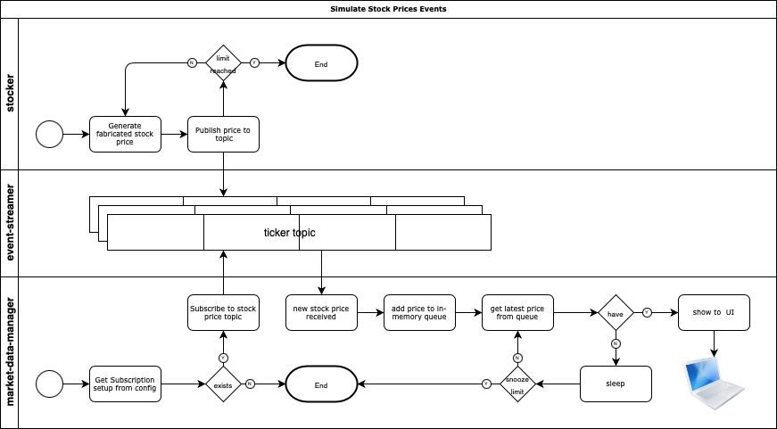

# market-data
[market-data-manager api](https://github.com/chiusday/market-data/tree/main/market-data-manager) returns stock prices produced by [stocker](https://github.com/chiusday/market-data/tree/main/stocker) delivered via Kafka. The prices is reactively shown in the UI for a specified period of time. If the time limit to wait  is reached the data streaming to the UI stops and the endpoint to stream the pirces has to be called again. 

## Overview:

**Note**: the internal queue is only there to make the data streaming to UI simplier