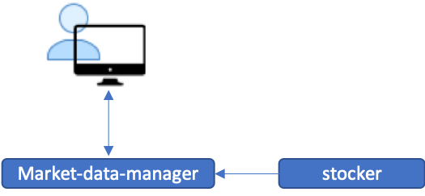

# market-data-manager
This is a Webflux version of [vertex-reactive](https://github.com/chiusday/samples/tree/master/vertx-reactive) project.
An API that reactively show the tickers from [stocker](https://github.com/chiusday/market-data/tree/main/stocker) simulated stocks to the UI.

## Overview:

In progress is the option to save the tickers to a DB so that further transformation can be done to the data. 

