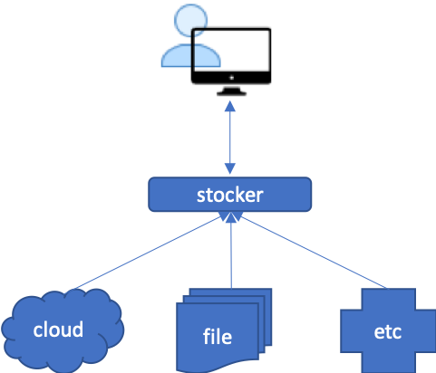

# stocker
Stock prices procurer. This API takes care of sourcing out stock prices and push the queried prices to Kafka.
This doesn't persist the data so information is always live as of source (cloud, file, other systems, etc). Analytics and other data manipulation should be handled by [market-data-manager api](https://github.com/chiusday/market-data)

## Overview:

**/simulate/intraday/{id}/limit/{limit}/interval/{interval}** - will generate a fabricated IntradayTicker where the symbol
is the provided **id**, **limit** is the number of stock prices to create, and **interval** is the time gap between stock
price creation.

**/av/intraday/{id}** - will get actual stock prices from [alphavantage](https://www.alphavantage.co/query?function=TIME_SERIES_INTRADAY&symbol={id}&apikey=demo&interval=5min).
The symbol is the **id** from the request. The **apikey** value in the config must be replaced with an actual key from [alphavantage.co](https://www.alphavantage.co/support/#api-key).

Both APIs will push the stock prices to Kafka.